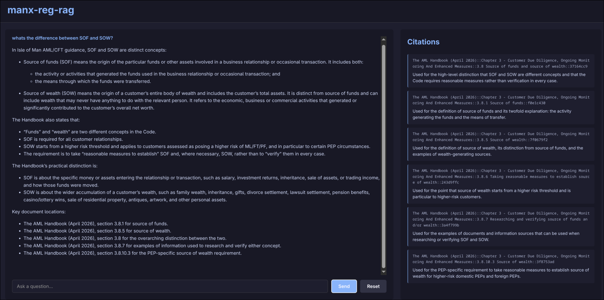
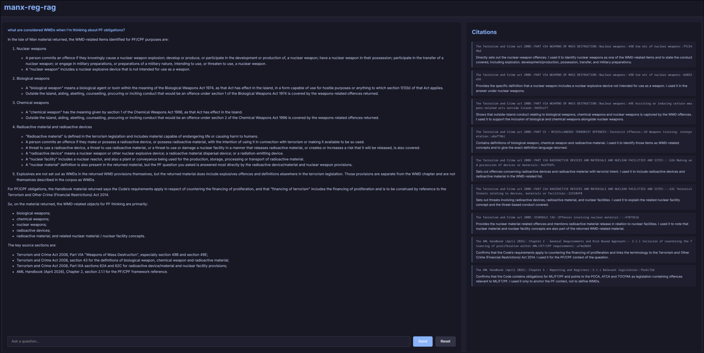
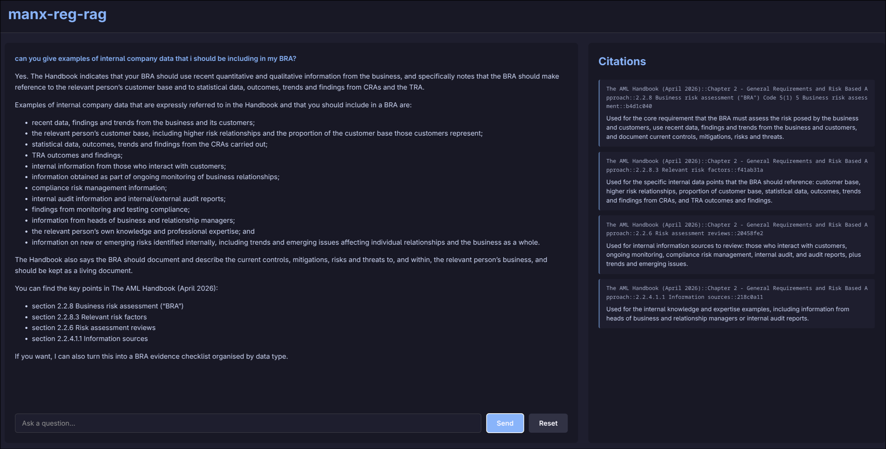
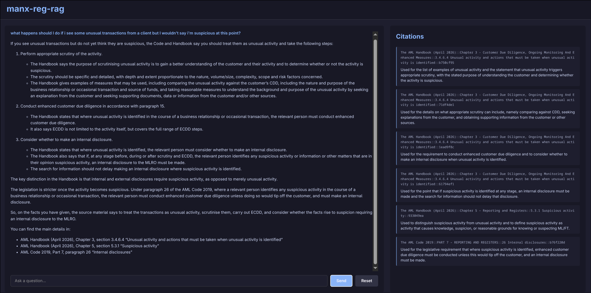
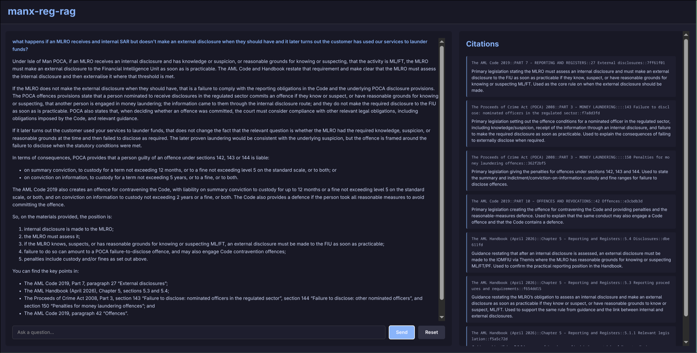

# manx-reg-rag

A question-and-answer tool for Isle of Man Licence Holders and Designated Businesses. Make any AI an expert in Isle of Man financial services legislation and regulation.

## What this is

manx-reg-rag answers compliance questions using the actual text of Isle of Man financial services legislation and guidance — not general knowledge. Ask it something in plain English, and it tells you what the source material actually says, and exactly which document and section the answer came from.

I'm a compliance professional, not a developer, and this is my first real attempt at building something like this. It's a genuine work in progress — see [Limitations](#limitations) before relying on anything it tells you.

## Why I built this

**The problem.** AI tools are trained on huge amounts of text, and that's where their "knowledge" comes from. Where the training data is thin, so is the understanding. Isle of Man financial services regulation is a small, specific field sitting inside a much bigger pool of UK and international material. Most IOM compliance practitioners will already have noticed that general-purpose AI, asked about IOM-specific requirements, tends to answer with UK law instead — because there's far more UK material to draw on — or, with weaker tools, simply makes something up.

**The solution.** The reliable way to give an AI knowledge it doesn't have is to hand it the actual source text at the moment you ask the question, and have it answer from that alone — a technique usually called Retrieval Augmented Generation, or RAG. It's not new technology, but as far as I know this is the first time it's been made available for Isle of Man regulation in an open, free format — free from me, at least. You'll still need to bring your own AI model, and if you're using a paid one, that cost is yours.

## How it works

Every answer is built from the actual text of Isle of Man legislation and guidance, retrieved fresh for each question — not from the AI's memory.

**Getting the documents ready.** Each source document is converted to text and broken into chunks — roughly section-sized pieces — along with exactly where in the document each piece sits (which Part, which paragraph) and which document it came from.

**Definitions.** Legal text is full of defined terms, and a chunk that uses one without its definition can be misleading on its own. So every defined term in each document is captured separately, and whenever a chunk uses one of those terms, its definition is pulled in alongside it automatically.

**Finding the right chunks.** All of this is stored in what's called a vector database. If that means nothing to you, you don't need it to — a rough picture: imagine a library where passages are shelved not alphabetically, but by what they're actually about, so chunks discussing similar things end up near each other even if they use completely different words. When you ask a question, it gets placed on that same shelf, and the tool pulls back whatever's sitting closest to it.

**The answer.** The retrieved chunks and their definitions are handed to the AI, which is instructed to answer only from what it's been given — not its own general knowledge — and to say so plainly if the material it retrieved doesn't actually answer your question, rather than guess. It also distinguishes legislation, which you must follow, from guidance, which is persuasive rather than binding. Alongside the answer, it lists exactly which passages it used and how. It's built to point you to the material, not to advise you — the judgement calls stay with you.

## What it covers right now

Right now the tool only knows AML/CFT-related material. Five documents are loaded:

- The AML/CFT Code 2019
- The AML Handbook (April 2026)
- The AML/CFT Supplemental Information Document
- The Proceeds of Crime Act 2008
- The Terrorism and Crime Act 2008
- The financial intelligence Unit Act 2011

More areas of Isle of Man financial services regulation are planned. For now, if your question falls outside AML/CFT, the tool doesn't have the material to answer it well — and it's built to tell you that rather than guess.

## See it in action

A few real questions, asked directly through the interface:











## Try it yourself

This isn't a one-click install yet, but if you want to run it on your own machine, here's what's involved.

**You'll need:**

- [Docker](https://www.docker.com/products/docker-desktop/) installed and running
- [uv](https://docs.astral.sh/uv/getting-started/installation/) installed — only needed for the first-time setup below
- An OpenAI API key — this needs an OpenAI account with billing set up, separate from a ChatGPT subscription. You'll be billed by OpenAI directly, based on usage.
- A terminal. On Windows, use WSL or Git Bash — the setup script is written for Mac/Linux-style shells.

**First-time setup (only needed once):**

1. Clone or download this repository, and open a terminal in the project folder.
2. Create a file named `.env` in that folder containing:

   ```env
   OPENAI_API_KEY=your-key-here
   ```

3. Install dependencies and build the document index:

   ```bash
   uv sync
   uv run python -m extraction_ops.ingest
   ```

4. Start the database and load the index into it:

   ```bash
   docker compose up -d qdrant
   uv run python -m db_ops.embeddings
   ```

**Running it, from here on:**

```bash
./launch.sh up
```

Then open `http://localhost:8000` in your browser.

*(If `./launch.sh` won't run, try `chmod +x launch.sh` first, or run `bash launch.sh up` instead.)*

Other commands: `./launch.sh down` stops everything, `./launch.sh logs` shows what's happening, `./launch.sh rebuild` rebuilds after any code changes.

## Limitations

- Only covers AML/CFT-related material right now — other areas of Isle of Man regulation aren't loaded yet.
- Retrieval isn't perfect. On an unusually phrased or very narrow question, the tool can retrieve the wrong section, and the answer will only be as good as what it retrieved.
- Hasn't been independently reviewed by any compliance professional other than the person building it.
- Self-hosting currently needs a few manual steps outside Docker for first-time setup, as above — not yet a single-command install.
- This is a tool for finding and referencing the right source material — not legal or regulatory advice, and not a substitute for your own professional judgement.

## Licence

This software is available under the AGPL v3 Licence.

## Contact

Questions, feedback, or found a bug? Email <cam01houston@gmail.com>.
